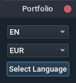
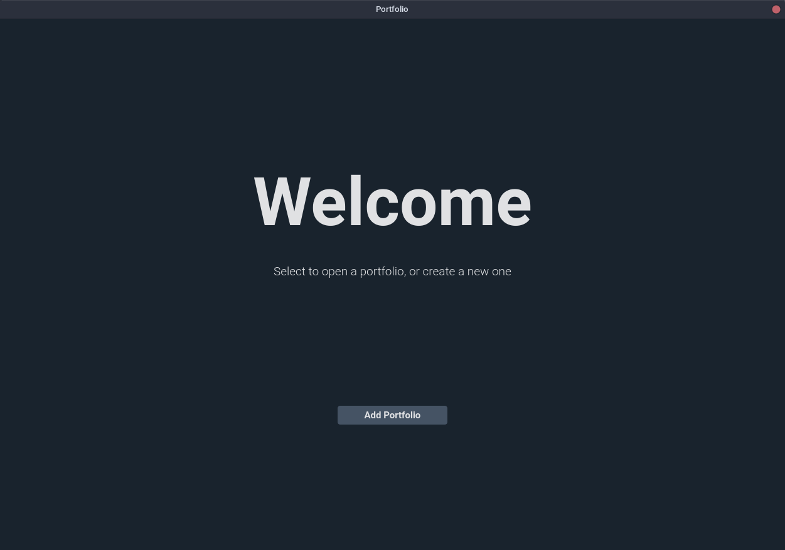
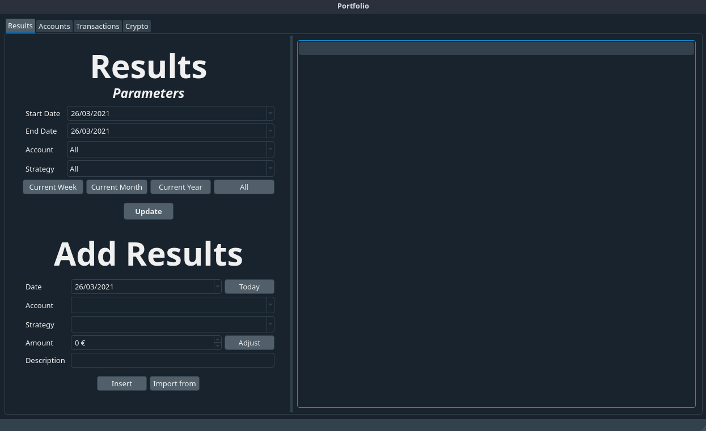

[ES](./README_ES.md)
# Portfolio

---

A simple GUI to track your investing, trading accounts and cryptocurrencies.

# Install

Make sure to have python installed.

Open your terminal and run:

```
git clone https://github.com/timeerr/portfolio.git
cd portfolio/
python install.py
```

You should now be able to execute the GUI now.
Run:

```
portfolio
```

# Usage

The first time you execute the app, you'll be prompted to select some preferences.



Then you'll end up on the Welcome Screen.



This is the place where you can add new portfolios and access them.
When you select a directory and add a portfolio, some data will be created inside that directory, which stores that portfolio's info.

Once you open a portfolio, you'll get to the main window.



Enjoy!
