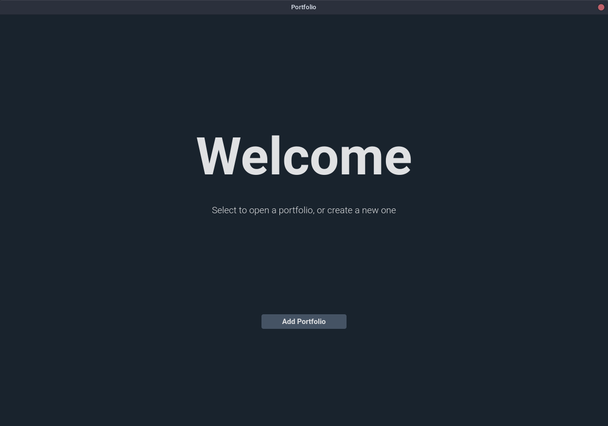

# Portfolio

---

Interfaz gráfica simple para monitorizar tus inversiones, cuentas de trading y criptomonedas.

# Instalar

Asegúrate de tener Python instalado.

Abre tu terminal y ejecuta:

```
git clone https://github.com/timeerr/portfolio.git
cd portfolio/
python install.py
```

Ya deberías de poder ejecutar la apliación.
Ejecuta:

```
portfolio
```

# Uso

La primera vez que abras la app, se te pedirá seleccionar la configuración inicial.


Serás llevado a la pantalla de inicio.



Este es el lugar donde puedes añadir nuevos portfolios y acceder a ellos.
Cuando eliges un directorio y añades un portfolio, se crearán datos dentro, que guardarán la información del portfolio.

Una vez abras un portfolio, acabarás en la pantalla principal.


**Que lo disfrutes!**
